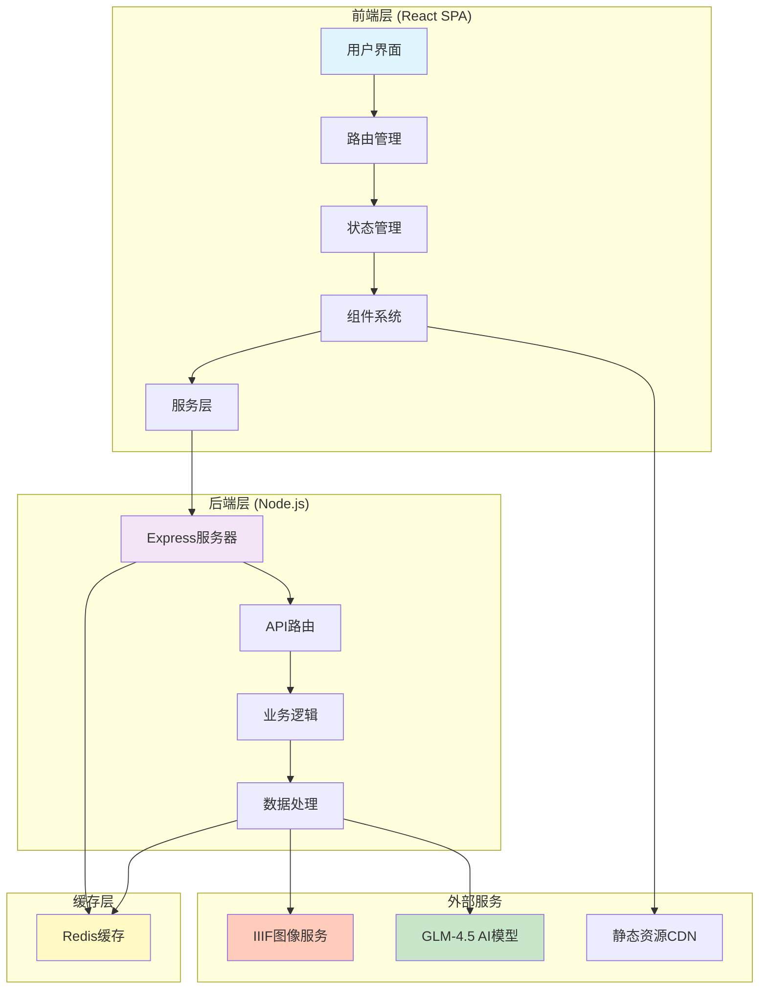

# 韬奋·纪念

<div align="center">

**沉浸式数字叙事平台**

关于邹韬奋的数字化文化传承平台

[](LICENSE)
[](https://react.dev/)
[](https://www.typescriptlang.org/)
[](https://nodejs.org/)

</div>

## 📖 目录

- [项目概述](#项目概述)
- [核心功能](#核心功能)
- [技术架构](#技术架构)
- [快速开始](#快速开始)
- [开发指南](#开发指南)
- [部署文档](#部署文档)
- [项目结构](#项目结构)
- [贡献指南](#贡献指南)
- [许可证](#许可证)

---

## 项目概述

### 核心定位

本项目致力于打造一个关于**邹韬奋**的沉浸式数字叙事平台,通过现代Web技术重现这位伟大新闻出版家、社会活动家的人生历程和思想遗产。项目不仅是技术展示,更是文化传承的数字化实践。

### 文化价值

- **历史传承**: 数字化保存和展示邹韬奋珍贵的历史文献和手迹
- **教育意义**: 为研究者、学者和公众提供直观的历史学习体验
- **技术创新**: 运用AI、IIIF等前沿技术重新定义文化展示方式
- **社会影响**: 促进传统文化与现代技术的深度融合

### 技术亮点

- 🤖 **AI智能解读**: 集成GLM-4.5大语言模型进行手迹智能分析
- 🖼️ **IIIF标准**: 采用国际图像互操作框架实现高清图像展示
- ⚡ **高性能架构**: Redis缓存 + 虚拟滚动 + 懒加载优化
- 🎨 **沉浸式体验**: 视差滚动、瀑布流布局、动态交互效果
- 📱 **响应式设计**: 完美适配桌面端和移动端设备

---

## 核心功能

### 1. 首页瀑布流展示 (HeroIntro)

- **视觉冲击**: 多张邹韬奋历史照片组成的动态瀑布流
- **沉浸体验**: 视差滚动与流动拼贴效果
- **性能优化**: 图片懒加载和预加载策略

### 2. 人生大事时间轴 (Timeline)

- **纵向时间轴**: 清晰展示邹韬奋人生重要节点
- **事件导航**: 快速定位到特定历史时期
- **丰富媒体**: 结合图片、文字、音频等多媒体内容

### 3. 生活书店模块 (Bookstore)

- **堆叠时间线**: 横轴时间 + 纵向堆叠避免重叠
- **书籍展示**: 缩略图卡片式书籍陈列
- **交互详情**: 点击进入书籍详细信息页

### 4. 韬奋手迹展示 (Handwriting)

- **Masonry布局**: 优雅的瀑布流图片排列
- **IIIF标准**: 高清图像查看和缩放
- **AI智能解读**: GLM-4.5模型手迹内容智能分析
- **性能优化**: 大量图片懒加载和虚拟滚动

### 5. 报刊文章模块 (Newspapers)

- **文章归档**: 邹韬奋相关报刊文章系统化整理
- **搜索过滤**: 按时间、主题、关键词筛选
- **阅读体验**: 优化的文章阅读界面

### 6. 人际关系网络 (Relationships)

- **关系图谱**: D3.js可视化社交网络
- **人物信息**: 详细的人物背景和关系说明
- **互动探索**: 支持点击查看具体人物详情

---

## 技术架构

### 系统架构图



### 技术栈

#### 前端技术

| 技术 | 版本 | 说明 |
|------|------|------|
| React | 18.3+ | 用户界面构建 |
| TypeScript | 5.5+ | 类型安全开发 |
| Vite | 5.4+ | 快速构建工具 |
| TailwindCSS | 3.4+ | CSS框架 |
| React Router | 7.7+ | 路由管理 |
| D3.js | 7.9+ | 数据可视化 |
| Framer Motion | 最新 | 动画库 |

#### 后端技术

| 技术 | 版本 | 说明 |
|------|------|------|
| Node.js | 20+ | JavaScript运行时 |
| Express | 4.18+ | Web应用框架 |
| Redis | 7+ | 缓存服务 |
| CORS | 2.8+ | 跨域资源共享 |

#### 特色技术

- **IIIF (International Image Interoperability Framework)**: 国际图像互操作框架
- **GLM-4.5**: 智谱AI大语言模型
- **Masonry**: 瀑布流布局算法
- **Cantaloupe**: IIIF图像服务器
- **Caddy**: 现代Web服务器

---

## 快速开始

### 环境要求

- **Node.js**: >= 20.0.0
- **npm**: >= 9.0.0
- **Docker**: >= 20.10 (可选,用于完整部署)
- **Git**: >= 2.30.0

### 本地开发

#### 1. 克隆项目

```bash
git clone https://github.com/your-org/taofen_web.git
cd taofen_web
```

#### 2. 安装依赖

```bash
# 安装前端依赖
cd frontend
npm install

# 安装后端依赖
cd ../backend
npm install
```

#### 3. 配置环境变量

创建 `backend/.env` 文件:

```bash
# AI服务配置
AI_API_KEY=your_ai_api_key_here
AI_API_BASE=https://open.bigmodel.cn/api/paas/v4/

# 服务配置
PORT=3001
NODE_ENV=development

# Redis配置
REDIS_URL=redis://:dev_redis_password_2024@localhost:6379
```

#### 4. 启动开发服务器

**方式一: 使用热更新机制 (推荐)**

```bash
# 检查5173端口是否被占用
# Windows (PowerShell)
netstat -ano | findstr :5173

# 如果端口被占用,直接访问现有服务
# 如果端口未被占用,启动前端开发服务器
cd frontend
npm run dev
```

前端服务启动后访问: **http://localhost:5173**

**方式二: 使用Docker完整环境**

```bash
# 启动所有服务
docker-compose -f docker-compose.dev.yml up -d

# 查看服务状态
docker-compose -f docker-compose.dev.yml ps

# 查看日志
docker-compose -f docker-compose.dev.yml logs -f
```

### 服务访问地址

| 服务 | 地址 | 说明 |
|------|------|------|
| 前端应用 | http://localhost:5173 | React开发服务器 |
| 后端API | http://localhost:3001 | Express后端服务 |
| IIIF服务 | http://localhost:8282 | Cantaloupe图像服务 |
| Redis | localhost:6379 | 缓存服务 |

---

## 开发指南

### 前端开发

#### 常用命令

```bash
cd frontend

# 启动开发服务器 (热更新)
npm run dev

# 生产构建
npm run build

# 代码检查
npm run lint

# 类型检查
npm run typecheck

# 运行测试
npm run test

# 端到端测试
npm run test:e2e

# 性能测试
npm run test:performance
```

#### 目录结构

```
frontend/
├── src/
│   ├── components/         # 按模块组织的组件
│   │   ├── bookstore/      # 生活书店模块
│   │   ├── handwriting/    # 韬奋手迹模块
│   │   ├── heroIntro/      # 首页介绍模块
│   │   ├── newspapers/     # 报刊文章模块
│   │   ├── relationships/  # 人际关系模块
│   │   └── timeline/       # 时间轴模块
│   ├── hooks/              # 自定义React Hooks
│   ├── services/           # API服务层
│   ├── styles/             # 样式文件
│   └── utils/              # 工具函数
├── public/                 # 静态资源
└── vite.config.ts          # Vite配置
```

### 后端开发

#### 常用命令

```bash
cd backend

# 启动开发服务器
npm run dev

# 启动生产服务器
npm start

# 运行测试
npm test
```

#### API路由

- `GET /api/health` - 健康检查
- `POST /api/ai/interpret` - AI手迹解读
- `GET /api/cache/:key` - 获取缓存
- `POST /api/cache/:key` - 设置缓存
- `DELETE /api/cache/:key` - 删除缓存

### 开发规范

#### Git提交规范

```bash
# 提交格式
git commit -m "type(scope): description"

# 类型说明
feat: 新功能
fix: 修复bug
docs: 文档更新
style: 代码格式调整
refactor: 重构代码
test: 测试相关
chore: 构建/工具变动

# 示例
git commit -m "feat(handwriting): 添加AI解读功能"
git commit -m "fix(timeline): 修复时间轴样式问题"
```

#### 代码风格

- 使用ESLint进行代码检查
- 使用Prettier进行代码格式化
- 遵循TypeScript最佳实践
- 组件命名使用PascalCase
- 文件命名使用kebab-case

---

## 部署文档

### Docker部署

#### 生产环境部署

```bash
# 使用生产配置启动所有服务
docker-compose up -d

# 查看服务状态
docker-compose ps

# 查看日志
docker-compose logs -f

# 停止服务
docker-compose down
```

#### 服务配置

生产环境包含以下服务:

- **cantaloupe**: IIIF图像服务 (端口8282)
- **taofen_backend**: 后端API服务 (端口3001)
- **redis**: 缓存服务 (端口6379)
- **caddy**: 反向代理 (端口80/443)

### 阿里云ECS部署

详细的部署指南请参考: [docs/阿里云ECS部署完整教程.md](docs/阿里云ECS部署完整教程.md)

#### 关键步骤

1. **服务器配置**
   - 操作系统: Ubuntu 20.04+
   - 内存: 至少2GB
   - 存储: 至少40GB

2. **环境准备**
   ```bash
   # 安装Docker
   curl -fsSL https://get.docker.com | sh

   # 安装Docker Compose
   sudo apt-get install docker-compose
   ```

3. **部署应用**
   ```bash
   # 克隆代码
   git clone <repository-url>
   cd taofen_web

   # 配置环境变量
   cp backend/.env.example backend/.env
   vim backend/.env

   # 启动服务
   docker-compose up -d
   ```

### 性能优化

#### 缓存策略

- **IIIF信息缓存**: 24小时
- **IIIF图像缓存**: 2小时
- **通用缓存**: 1小时 (可配置)

#### 前端优化

- 代码分割和懒加载
- 图片压缩和WebP格式
- 虚拟滚动和分页加载
- Service Worker缓存

#### 后端优化

- Redis缓存加速
- Gzip压缩
- CDN静态资源分发
- 数据库查询优化

---

## 项目结构

```
taofen_web/
├── frontend/              # React前端应用
│   ├── src/
│   │   ├── components/    # React组件
│   │   ├── hooks/         # 自定义Hooks
│   │   ├── services/      # API服务
│   │   ├── styles/        # 样式文件
│   │   └── utils/         # 工具函数
│   ├── public/            # 静态资源
│   └── package.json       # 前端依赖
├── backend/              # Node.js后端
│   ├── routes/           # API路由
│   ├── middleware/       # 中间件
│   ├── services/         # 业务服务
│   ├── server.js         # 服务器入口
│   └── package.json      # 后端依赖
├── scripts/              # 工具脚本
├── docs/                 # 项目文档
├── diss/                 # 讨论文档
├── data/                 # 数据文件
├── docker-compose.yml    # Docker配置
├── docker-compose.dev.yml # 开发环境配置
└── README.md             # 项目说明
```

---

## 测试

### 前端测试

```bash
cd frontend

# 单元测试
npm run test

# 测试覆盖率
npm run test:coverage

# 端到端测试
npm run test:e2e

# 性能测试
npm run test:performance
```

### 后端测试

```bash
cd backend

# 运行所有测试
npm test

# 运行特定测试
npm test -- --grep "API"
```

---

## 故障排除

### 常见问题

#### 1. 端口冲突

```bash
# 查看端口占用
# Windows
netstat -ano | findstr :5173

# 停止占用进程
taskkill /PID <PID> /F
```

#### 2. 依赖安装失败

```bash
# 清除缓存
npm cache clean --force

# 删除node_modules重新安装
rm -rf node_modules package-lock.json
npm install
```

#### 3. Docker服务启动失败

```bash
# 查看服务日志
docker-compose logs -f

# 重启服务
docker-compose restart

# 完全重置
docker-compose down -v
docker-compose up -d
```

### 调试技巧

#### 前端调试

- 使用React DevTools浏览器扩展
- 控制台查看组件日志
- Network面板查看API请求

#### 后端调试

- 使用VS Code调试配置
- 查看服务器日志
- 使用Postman测试API

---

## 贡献指南

我们欢迎所有形式的贡献!

### 如何贡献

1. Fork本项目
2. 创建特性分支 (`git checkout -b feature/AmazingFeature`)
3. 提交更改 (`git commit -m 'feat: add some amazing feature'`)
4. 推送到分支 (`git push origin feature/AmazingFeature`)
5. 开启Pull Request

### 开发流程

1. 在GitHub上寻找感兴趣的Issue
2. 评论表明你想处理这个Issue
3. 创建分支并进行开发
4. 确保代码通过测试
5. 提交Pull Request

### 代码审查

- 所有代码需要经过审查才能合并
- 确保代码符合项目规范
- 添加必要的测试和文档

---

## 文档资源

- [本地开发环境指南](docs/本地开发环境指南.md)
- [阿里云ECS部署完整教程](docs/阿里云ECS部署完整教程.md)
- [AI环境配置指南](docs/AI_ENV_SETUP.md)
- [IIIF API错误分析报告](docs/IIIF%20API错误分析报告.md)

---

## 版本历史

- **v0.0.3** - 优化性能和用户体验
- **v0.0.2** - 添加AI解读功能
- **v0.0.1** - 初始版本发布

详细版本信息请查看 [docs/VERSION_*.md](docs/)

---

## 许可证

本项目采用 MIT 许可证 - 详见 [LICENSE](LICENSE) 文件

---

## 致谢

- 智谱AI提供GLM-4.5大语言模型支持
- IIIF国际图像互操作框架社区
- 所有为本项目做出贡献的开发者

---

## 联系方式

- 项目主页: [GitHub Repository](https://github.com/your-org/taofen_web)
- 问题反馈: [Issues](https://github.com/your-org/taofen_web/issues)
- 邮箱: contact@example.com

---

<div align="center">

**让我们一起用技术传承文化** ⭐

如果这个项目对你有帮助,请给我们一个Star!

</div>
