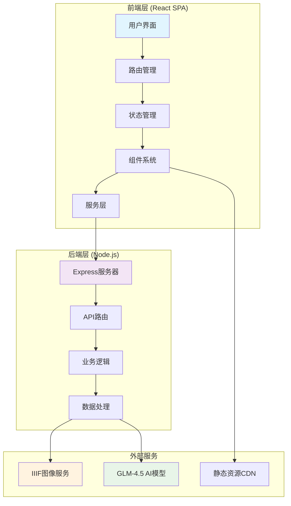
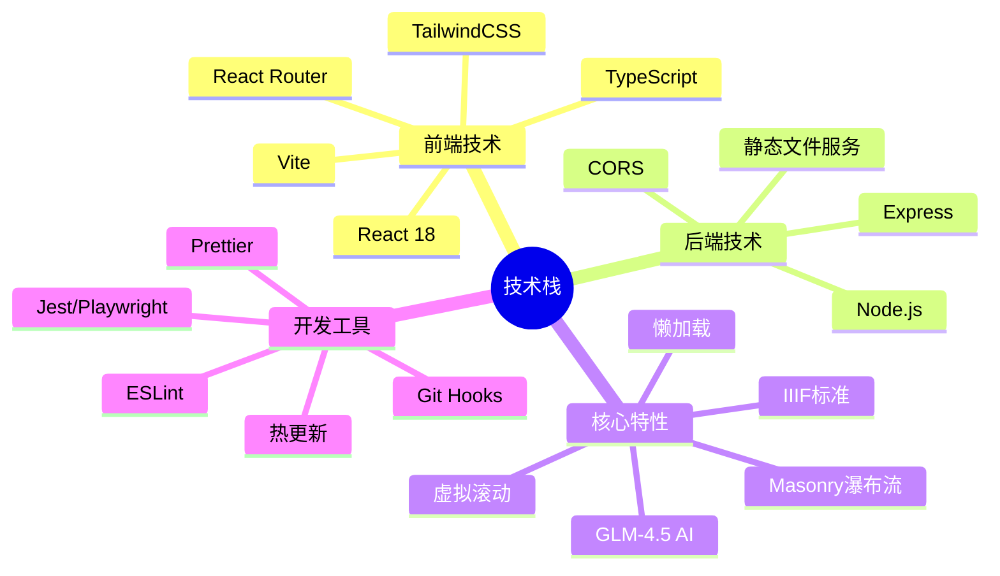
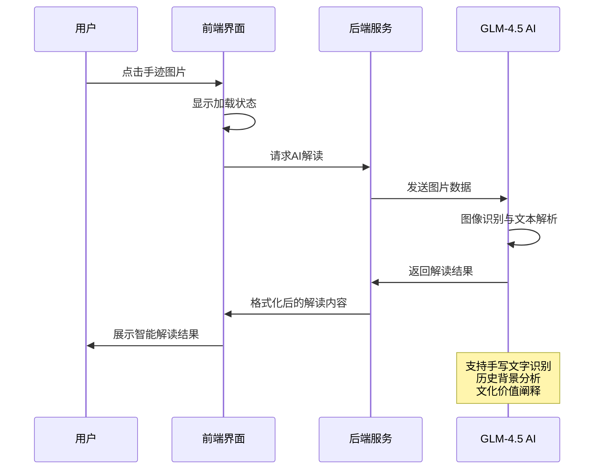

# 邹韬奋沉浸式叙事项目

<div align="center">


**传承历史文化 · 融合现代技术 · 沉浸式体验**

[](LICENSE)
[](https://nodejs.org/)
[](https://reactjs.org/)
[](https://www.typescriptlang.org/)

</div>

## 🎯 项目概述

### 核心定位

本项目致力于打造一个关于**邹韬奋**的沉浸式数字叙事平台，通过现代Web技术重现这位伟大新闻出版家、社会活动家的人生历程和思想遗产。项目不仅是技术展示，更是文化传承的数字化实践。

### 文化价值

- **历史传承**：数字化保存和展示邹韬奋珍贵的历史文献和手迹
- **教育意义**：为研究者、学者和公众提供直观的历史学习体验
- **技术创新**：运用AI、IIIF等前沿技术重新定义文化展示方式
- **社会影响**：促进传统文化与现代技术的深度融合

## 🏗️ 系统架构



## 📁 项目结构

```
taofen_web/
├── 📁 frontend/                 # React前端应用
│   ├── 📁 public/              # 静态资源
│   ├── 📁 src/
│   │   ├── 📁 components/      # React组件
│   │   │   ├── 📁 bookstore/   # 生活书店模块
│   │   │   ├── 📁 handwriting/ # 韬奋手迹模块
│   │   │   ├── 📁 heroIntro/   # 首页介绍模块
│   │   │   ├── 📁 newspapers/  # 报刊文章模块
│   │   │   ├── 📁 relationships/ # 人际关系模块
│   │   │   └── 📁 timeline/    # 时间轴模块
│   │   ├── 📁 hooks/           # 自定义React Hooks
│   │   ├── 📁 services/        # API服务层
│   │   ├── 📁 styles/          # 样式文件
│   │   └── 📁 utils/           # 工具函数
│   ├── 📄 package.json         # 前端依赖配置
│   └── 📄 vite.config.js       # Vite构建配置
├── 📁 backend/                 # Node.js后端服务
│   ├── 📁 routes/              # API路由
│   ├── 📁 middleware/          # 中间件
│   ├── 📁 services/            # 业务服务
│   ├── 📄 server.js            # 服务器入口
│   └── 📄 package.json         # 后端依赖配置
├── 📁 scripts/                 # 工具脚本
├── 📁 docs/                    # 项目文档
├── 📁 diss/                    # 讨论文档
└── 📄 README.md                # 项目说明
```

## 🎨 核心功能模块

### 1. 首页瀑布流展示 (HeroIntro)
- **视觉冲击**：多张邹韬奋历史照片组成的动态瀑布流
- **沉浸体验**：视差滚动与流动拼贴效果
- **响应式设计**：适配各种设备尺寸

### 2. 人生大事时间轴 (Timeline)
- **纵向时间轴**：清晰展示邹韬奋人生重要节点
- **事件跳转**：快速定位到特定历史时期
- **丰富媒体**：结合图片、文字、音频等多媒体内容

### 3. 生活书店模块 (Bookstore)
- **堆叠时间线**：横轴时间 + 纵向堆叠避免重叠
- **书籍展示**：缩略图卡片式书籍陈列
- **详情页面**：点击进入书籍详细信息页

### 4. 韬奋手迹展示 (Handwriting)
- **瀑布流布局**：使用Masonry实现优雅的图片排列
- **IIIF标准**：基于国际图像互操作框架的高清图像查看
- **AI智能解读**：集成GLM-4.5模型对手迹内容进行智能分析
- **懒加载优化**：提升大量图片的加载性能

### 5. 报刊文章模块 (Newspapers)
- **文章归档**：邹韬奋相关报刊文章的系统化整理
- **搜索过滤**：支持按时间、主题、关键词筛选
- **阅读体验**：优化的文章阅读界面

### 6. 人际关系网络 (Relationships)
- **关系图谱**：可视化展示邹韬奋的社交网络
- **人物信息**：详细的人物背景和关系说明
- **互动探索**：支持点击查看具体人物详情

## 🛠️ 技术栈



### 前端技术
- **React 18**：现代化的用户界面构建
- **TypeScript**：类型安全的JavaScript开发
- **Vite**：快速的构建工具和开发服务器
- **TailwindCSS**：实用优先的CSS框架
- **React Router**：单页应用路由管理

### 后端技术
- **Node.js**：JavaScript运行时环境
- **Express**：轻量级Web应用框架
- **CORS**：跨域资源共享处理
- **静态文件服务**：高效的资源分发

### 特色技术
- **IIIF (International Image Interoperability Framework)**：国际图像互操作框架
- **GLM-4.5**：智谱AI大语言模型，用于手迹内容解读
- **Masonry**：瀑布流布局算法
- **虚拟滚动**：大数据量列表性能优化
- **IntersectionObserver**：高性能的可视区域监听

## 💡 AI智能解读功能



### AI功能特点
- **手写识别**：准确识别邹韬奋手写文字内容
- **语义理解**：分析文本的历史背景和文化含义
- **智能摘要**：提取关键信息并生成简明解读
- **多维分析**：从历史、文化、社会等多个角度解读内容

## 🚀 快速开始

### 环境要求
- **Node.js**: 18.0.0 或更高版本
- **npm**: 8.0.0 或更高版本
- **Git**: 用于版本控制

### 安装步骤

1. **克隆项目**
```bash
git clone https://github.com/your-username/taofen_web.git
cd taofen_web
```

2. **安装依赖**
```bash
# 安装根目录依赖
npm install

# 安装前端依赖
cd frontend
npm install

# 安装后端依赖
cd ../backend
npm install
```

3. **环境配置**
```bash
# 在frontend目录创建环境变量文件
cp .env.example .env.development
cp .env.example .env.production

# 在backend目录创建环境变量文件
cp .env.example .env
```

4. **启动开发服务器**
```bash
# 在项目根目录启动完整开发环境
npm run dev

# 或者分别启动前后端服务
npm run dev:frontend  # 启动前端开发服务器 (端口: 5173)
npm run dev:backend   # 启动后端服务器 (端口: 3001)
```

### 开发服务器信息
- **前端服务器**: http://localhost:5173
- **后端API服务器**: http://localhost:3001
- **热更新**: 支持文件保存后自动刷新

## 📋 可用脚本

### 前端脚本
```bash
npm run dev          # 启动开发服务器
npm run build        # 构建生产版本
npm run preview      # 预览构建结果
npm run lint         # 代码规范检查
npm run typecheck    # TypeScript类型检查
npm run test         # 运行测试
npm run test:e2e     # 端到端测试
```

### 后端脚本
```bash
npm start            # 启动生产服务器
npm run dev          # 启动开发服务器 (nodemon)
npm test             # 运行后端测试
```

### 项目级脚本
```bash
npm run dev:all      # 同时启动前后端服务
npm run build:all    # 构建前后端项目
npm run test:all     # 运行所有测试
npm run clean        # 清理构建文件
```

## 🧪 测试

### 测试框架
- **Jest**: JavaScript单元测试框架
- **React Testing Library**: React组件测试工具
- **Playwright**: 端到端自动化测试

### 运行测试
```bash
# 前端单元测试
cd frontend && npm run test

# 前端组件测试
cd frontend && npm run test:components

# 端到端测试  
cd frontend && npm run test:e2e

# 后端API测试
cd backend && npm test

# 生成测试覆盖率报告
npm run test:coverage
```

### 测试结构
```
frontend/src/__tests__/
├── components/         # 组件测试
├── hooks/             # Hook测试  
├── services/          # 服务层测试
└── utils/             # 工具函数测试
```

## 📚 API文档

### 核心API端点

#### 手迹相关API
```
GET    /api/handwriting              # 获取手迹列表
GET    /api/handwriting/:id          # 获取特定手迹详情
POST   /api/handwriting/:id/ai       # 请求AI解读
```

#### 时间轴API
```
GET    /api/timeline                 # 获取时间轴事件
GET    /api/timeline/:period         # 获取特定时期事件
```

#### 书店API  
```
GET    /api/bookstore               # 获取书籍列表
GET    /api/bookstore/:id           # 获取书籍详情
GET    /api/bookstore/search        # 搜索书籍
```

#### 人际关系API
```
GET    /api/relationships           # 获取关系网络数据
GET    /api/relationships/:personId # 获取特定人物信息
```

### API响应格式
```json
{
  "success": true,
  "data": {...},
  "message": "操作成功",
  "timestamp": "2024-01-01T12:00:00Z"
}
```

## 🎨 开发规范

### 代码风格
- **ESLint**: 代码质量检查
- **Prettier**: 代码格式化
- **TypeScript**: 严格类型检查
- **组件命名**: PascalCase
- **文件命名**: kebab-case

### Git提交规范
```
feat: 新功能
fix: 修复bug  
docs: 文档更新
style: 代码格式调整
refactor: 代码重构
test: 测试相关
chore: 构建/工具相关
```

### 组件开发规范
```typescript
// 组件文件结构示例
import React from 'react';
import type { ComponentProps } from './types';
import styles from './Component.module.css';

interface Props extends ComponentProps {
  // 组件属性定义
}

export const Component: React.FC<Props> = ({ ...props }) => {
  // 组件实现
  return <div>...</div>;
};

export default Component;
```

## 🔧 配置文件

### 前端配置
- **vite.config.js**: Vite构建配置
- **tailwind.config.js**: TailwindCSS样式配置
- **tsconfig.json**: TypeScript编译配置
- **eslint.config.js**: ESLint规则配置

### 后端配置
- **package.json**: 依赖和脚本配置
- **.env**: 环境变量配置
- **nodemon.json**: 开发服务器配置

## 📦 构建与部署

### 构建生产版本
```bash
# 构建前端
cd frontend && npm run build

# 构建后端 (如需要)
cd backend && npm run build
```

### 部署配置
```bash
# 前端部署到静态托管服务
npm run deploy:frontend

# 后端部署到服务器
npm run deploy:backend

# 完整部署
npm run deploy:all
```

### Docker部署 (可选)
```dockerfile
# Dockerfile示例
FROM node:18-alpine
WORKDIR /app
COPY package*.json ./
RUN npm ci --only=production
COPY . .
EXPOSE 3000
CMD ["npm", "start"]
```

## 🤝 贡献指南

### 参与贡献
1. Fork项目到你的GitHub账户
2. 创建新的功能分支 (`git checkout -b feature/amazing-feature`)
3. 提交你的修改 (`git commit -m 'feat: add amazing feature'`)
4. 推送分支 (`git push origin feature/amazing-feature`)
5. 创建Pull Request

### 代码审查标准
- ✅ 代码符合项目规范
- ✅ 包含相应的测试
- ✅ 文档已更新
- ✅ 通过所有自动化检查
- ✅ 功能完整且无bug

### 问题报告
使用GitHub Issues报告bug或提出功能建议，请包含：
- 详细的问题描述
- 重现步骤
- 期望行为
- 实际行为
- 环境信息（浏览器、Node.js版本等）

## 📄 许可证

本项目采用 [MIT License](LICENSE) 开源许可证。

## 👥 维护者

- **主要维护者**: [项目团队]
- **技术负责人**: [技术负责人]
- **文档维护**: [文档团队]

## 🙏 致谢

感谢所有为这个项目做出贡献的开发者、设计师和研究者。特别感谢：

- 邹韬奋纪念馆提供的珍贵历史资料
- IIIF社区的技术标准支持
- 智谱AI团队的GLM模型支持
- 所有测试用户的宝贵反馈

## 📞 联系我们

- **项目主页**: https://github.com/your-username/taofen_web
- **问题反馈**: https://github.com/your-username/taofen_web/issues
- **邮箱**: your-email@example.com

---

<div align="center">

**传承韬奋精神 · 拥抱数字未来**

Made with ❤️ for cultural heritage preservation

</div>