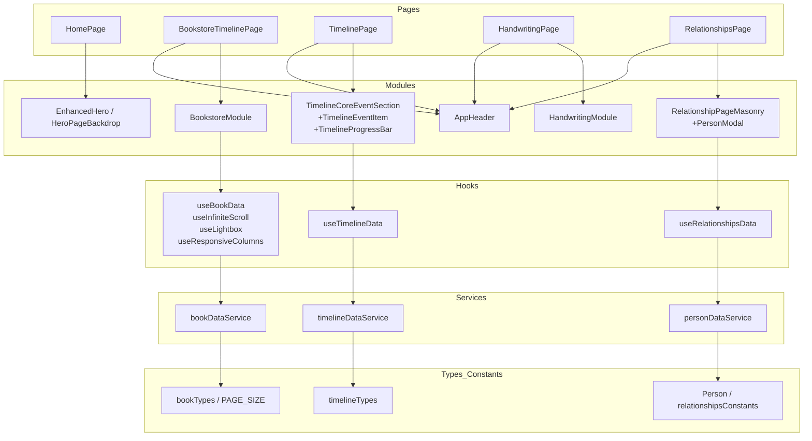

## 前端核心模块梳理（frontend）

### 全局入口与路由
- `frontend/src/main.tsx`: 应用入口，挂载到根节点并启用 `BrowserRouter`。
- `frontend/src/App.tsx`: 定义页面路由。
  - `/` → `HomePage`
  - `/bookstore-timeline` → `BookstoreTimelinePage`
  - `/timeline` → `TimelinePage`
  - `/handwriting` → `HandwritingPage`
  - `/relationships` → `RelationshipsPage`

### 目录结构（精简视图）
- `components/`
  - `bookstore/`: 生活书店模块（筛选/瀑布流/详情）
  - `timeline/`: 人生大事时间轴模块
  - `handwriting/`: 韬奋手迹模块（示例数据、瀑布流、Lightbox）
  - `relationships/`: 人物关系模块（瀑布流+详情弹窗）
  - `heroIntro/`: 首页 Hero（拼贴背景、视差动画）
  - `layout/header/`: 头部导航（`AppHeader`）
- `pages/`: 页面级容器（按路由对应）
- `hooks/`: 自定义 Hooks（数据获取、无限滚动、灯箱、响应式列数等）
- `services/`: 数据层（文件/接口读取与分页）
- `types/`: 领域类型定义
- `constants/`: 常量与配置
- `styles/`: 样式文件（Tailwind + 自定义CSS）

---

## 核心叙事模块

### 1) 人生大事（时间轴）
- 页面与组件
  - `pages/TimelinePage.tsx`: 页面容器，注入 `AppHeader` 与时间轴主体
  - `components/timeline/TimelineProgressBar.tsx`: 滚动进度条
  - `components/timeline/TimelineCoreEventSection.tsx`: 核心事件分组（可折叠/展开）
  - `components/timeline/TimelineEventItem.tsx`: 单条事件项（支持人名高亮并外链）
- 数据与样式
  - `hooks/useTimelineData.ts`: 读取 `/data/timeline.json`，提供加载/错误状态
  - `styles/timeline.css`: 时间轴样式
- 关键交互
  - 首条事件为“特色事件”，点击展开同组其余事件
  - 文本人名由 `utils/personMatcher.ts` 匹配并跳转外部资料

### 2) 生活书店（堆叠时间线 / 图书瀑布流）
- 页面与组件
  - `pages/BookstoreTimelinePage.tsx`: 页面容器 + `AppHeader`
  - `components/bookstore/BookstoreModule.tsx`: 顶层业务容器（筛选、分页、布局、灯箱）
  - `components/bookstore/BookFiltersPanel.tsx`: 搜索/年份筛选/导出
  - `components/bookstore/BookGridContainer.tsx`: 瀑布流列布局与可见性渲染
  - `components/bookstore/BookCardContainer.tsx`: 图书卡片（懒加载、入场动画）
  - `components/bookstore/BookDetailModal.tsx`: 详情弹窗（左右切换）
- 数据流
  - `hooks/useBookData.ts`: 首次加载全量索引 + 分页读取、筛选、去抖刷新
  - `services/bookDataService.ts`: 统一数据读取与分页接口
  - `constants/bookConstants.ts`: 如 `PAGE_SIZE` 等配置
  - `utils/bookUtils.ts`: `downloadCSV` 导出当前结果
- 关键交互
  - 搜索、分类、年份筛选；滚动到底部自动加载；点击卡片进入灯箱；CSV 导出

### 3) 韬奋手迹（手迹/手稿/文献）
- 页面与组件
  - `pages/HandwritingPage.tsx`: 页面容器
  - `components/handwriting/HandwritingModule.tsx`: 内置演示数据 + Masonry 瀑布流 + Lightbox
  - `components/handwriting/HandwritingHeader.tsx`: 模块头部（与 `AppHeader`配合）
- 关键交互
  - 关键词/类型/年份筛选；懒加载入场；高清图预览与左右切换
  - 该模块目前使用内置示例数据，未来可接入统一数据服务

### 4) 人物关系（知识关系网络 → 卡片瀑布流）
- 页面与组件
  - `pages/RelationshipsPage.tsx`: 页面容器 + 分类筛选 + 统计 + 详情 Modal
  - `components/relationships/RelationshipPageMasonry.tsx`: 自适应 Masonry 瀑布流
  - `components/relationships/RelationshipPagePersonModal.tsx`: 人物详情卡片（来源链接）
- 数据与配置
  - `hooks/useRelationshipsData.ts`: 读取并标准化人物数据（含分类）
  - `constants/relationshipsConstants.ts`: 分类、配色与图标
- 关键交互
  - 分类标签筛选、滚动懒加载、人物详情查看与外链跳转

### 5) 首页（沉浸式 Hero）
- 页面与组件
  - `pages/HomePage.tsx`: 首页容器
  - `components/heroIntro/EnhancedHero.tsx`: 强化版 Hero（标题/引导/按钮）
  - `components/heroIntro/HeroPageBackdrop.tsx`: 拼贴背景（列布局 + 视差滚动）
- 说明
  - 首页承担“叙事入口”的视觉与导航职责，导向四大核心模块

---

## 横切关注点
- `components/layout/header/AppHeader.tsx` + `constants/header.configs.tsx`: 按模块切换导航配置
- `types/`: `bookTypes.ts`、`timelineTypes.ts`、`Person.ts`、`personTypes.ts` 等领域模型
- `services/`: `bookDataService.ts`、`timelineDataService.ts`、`personDataService.ts`（统一数据访问）
- `hooks/`: `useInfiniteScroll`、`useLightbox`、`useResponsiveColumns` 等提升复用度
- `styles/`: `index.css`、`bookstore.css`、`relationships.css`、`timeline.css`

---

## 模块关系图（Mermaid）

---

## 与 README 叙事目标的映射
- 人生大事 → 时间轴模块（纵向叙事、核心事件展开）
- 生活书店 → 图书堆叠时间线/瀑布流（卡片化时间印记）
- 韬奋手迹 → Masonry + 高分预览（IIIF 接入预留）
- 人物关系 → 关系视角的人物影像与线索汇聚
- 首页 → 以历史影像拼贴设定整体叙事情绪与导航路径

---

## 后续建议（最小改动优先）
- 样式体系：逐步统一到 Tailwind 与设计系统（参考 `docs/DESIGN_SYSTEM.md`）
- 数据服务：手迹模块从内置示例过渡到统一服务层，复用分页/筛选能力
- 可访问性：关键交互组件补充 aria 属性与键盘操作路径

