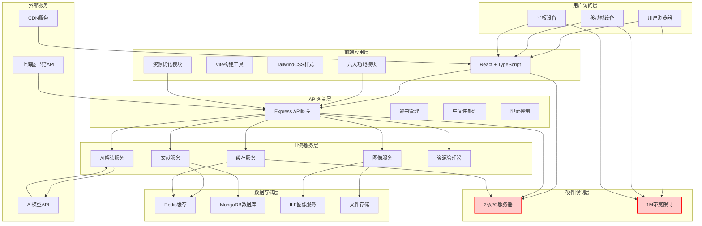
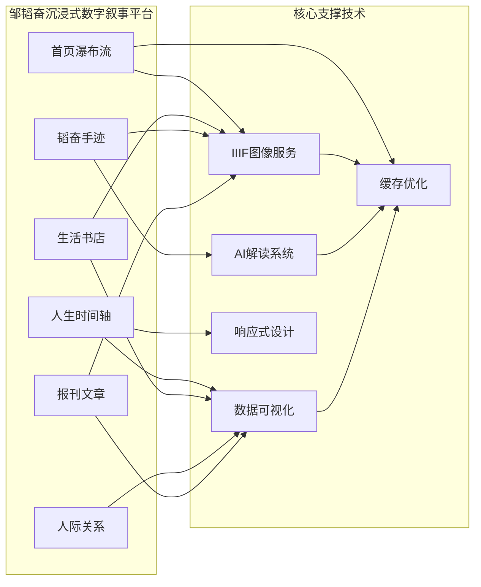
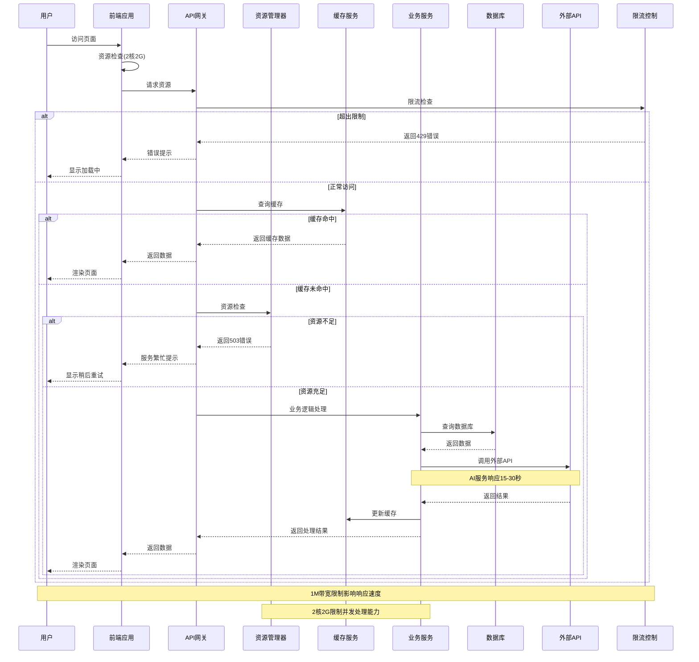
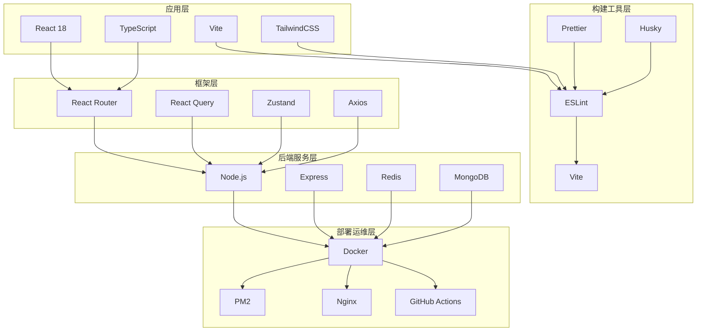

# 邹韬奋沉浸式数字叙事平台 - 项目结构图

## 整体架构图（实际部署环境）



## 功能模块结构图



## 数据流程图（实际资源限制下的优化流程）



## 技术栈层次图



## 部署架构图（单服务器实际部署）

```mermaid
graph TB
    subgraph "用户访问层"
        A[用户浏览器]
        B[移动设备]
    end
    
    subgraph "单服务器硬件层"
        C[2核2G云服务器]
        D[1M带宽]
    end
    
    subgraph "反向代理层"
        E[Caddy代理]
        F[SSL证书]
    end
    
    subgraph "Docker容器层"
        G[前端容器]
        H[后端API容器]
        I[Redis容器]
        J[IIIF容器]
    end
    
    subgraph "数据存储层"
        K[Redis缓存]
        L[MongoDB数据库]
        M[文件存储]
    end
    
    subgraph "外部服务"
        N[上海图书馆API]
        O[AI服务API]
        P[CDN服务]
    end
    
    subgraph "监控优化层"
        Q[PM2进程管理]
        R[资源监控]
        S[自动重启]
    end
    
    A --> C
    B --> C
    
    C --> E
    D --> E
    
    E --> G
    E --> H
    E --> I
    E --> J
    
    G --> K
    H --> K
    H --> L
    I --> K
    J --> M
    
    H --> N
    H --> O
    G --> P
    
    Q --> G
    Q --> H
    Q --> I
    Q --> J
    
    R --> C
    S --> Q
    
    style C fill:#ffcccc,stroke:#ff0000,stroke-width:2px
    style D fill:#ffcccc,stroke:#ff0000,stroke-width:2px
    
    Note over C,R: 单服务器资源限制
    Note over G,S: 容器资源竞争
```

## 功能模块详细关系图

```mermaid
graph TB
    subgraph "首页模块"
        A1[瀑布流布局]
        A2[图片懒加载]
        A3[响应式设计]
        A4[动画效果]
    end
    
    subgraph "时间轴模块"
        B1[时间节点展示]
        B2[事件筛选]
        B3[多媒体整合]
        B4[交互式导航]
    end
    
    subgraph "书店模块"
        C1[书籍展示]
        C2[出版时间线]
        C3[3D效果]
        C4[详情查看]
    end
    
    subgraph "手迹模块"
        D1[IIIF图像查看]
        D2[AI解读功能]
        D3[图像处理]
        D4[下载打印]
    end
    
    subgraph "关系模块"
        E1[网络图展示]
        E2[关系筛选]
        E3[路径发现]
        E4[详情关联]
    end
    
    subgraph "报刊模块"
        F1[文章列表]
        F2[全文搜索]
        F3[分类归档]
        F4[阅读体验]
    end
    
    subgraph "共享服务"
        G1[用户认证]
        G2[数据缓存]
        G3[文件上传]
        G4[日志记录]
    end
    
    A1 --> G2
    A2 --> G2
    B1 --> G2
    B2 --> G2
    C1 --> G2
    D1 --> G2
    D2 --> G2
    E1 --> G2
    F1 --> G2
    F2 --> G2
    
    D2 --> G1
    E1 --> G1
    F1 --> G1
    
    A3 --> G3
    C1 --> G3
    D1 --> G3
    F1 --> G3
    
    A1 --> G4
    B1 --> G4
    C1 --> G4
    D1 --> G4
    E1 --> G4
    F1 --> G4
```



## 性能优化策略图（针对2核2G服务器）

```mermaid
graph TD
    subgraph "前端优化策略"
        A[图片懒加载]
        B[虚拟滚动]
        C[组件按需加载]
        D[内存缓存管理]
        E[代码分割]
    end
    
    subgraph "后端优化策略"
        F[Redis多级缓存]
        G[请求限流控制]
        H[连接池管理]
        I[异步处理队列]
        J[资源监控告警]
    end
    
    subgraph "数据优化策略"
        K[数据库索引优化]
        L[查询结果缓存]
        M[数据压缩传输]
        N[分页加载机制]
        O[CDN加速]
    end
    
    subgraph "AI服务优化"
        P[请求队列管理]
        Q[结果缓存机制]
        R[超时重试策略]
        S[负载均衡分配]
        T[降级服务方案]
    end
    
    subgraph "容器资源优化"
        U[内存限制配置]
        V[CPU优先级设置]
        W[自动重启机制]
        X[日志轮转清理]
        Y[健康检查]
    end
    
    A --> U
    B --> U
    C --> U
    D --> U
    E --> U
    
    F --> V
    G --> V
    H --> V
    I --> V
    J --> V
    
    K --> W
    L --> W
    M --> W
    N --> W
    O --> W
    
    P --> X
    Q --> X
    R --> X
    S --> X
    T --> X
    
    style U fill:#ffcccc,stroke:#ff0000,stroke-width:2px
    style V fill:#ffcccc,stroke:#ff0000,stroke-width:2px
    style W fill:#ffcccc,stroke:#ff0000,stroke-width:2px
    style X fill:#ffcccc,stroke:#ff0000,stroke-width:2px
    
    Note over A,T: 针对2核2G硬件限制的优化策略
    Note over U,Y: 确保系统稳定运行
```

## 缓存架构图（应对资源限制）

```mermaid
graph LR
    subgraph "前端缓存层"
        A[浏览器缓存]
        B[内存缓存]
        C[组件状态缓存]
        D[图片预加载缓存]
    end
    
    subgraph "API网关缓存"
        E[响应结果缓存]
        F[限流状态缓存]
        G[用户会话缓存]
    end
    
    subgraph "Redis缓存层"
        H[热点数据缓存]
        I[查询结果缓存]
        J[AI结果缓存]
        K[会话状态缓存]
    end
    
    subgraph "数据库缓存"
        L[查询计划缓存]
        M[连接池缓存]
    end
    
    subgraph "外部服务缓存"
        N[上海图书馆API缓存]
        O[AI模型响应缓存]
    end
    
    A --> E
    B --> E
    C --> E
    D --> E
    
    E --> H
    F --> H
    G --> H
    
    H --> L
    H --> M
    H --> N
    H --> O
    
    J --> O
    K --> O
    
    style H fill:#ffffcc,stroke:#ff9900,stroke-width:2px
    style J fill:#ffffcc,stroke:#ff9900,stroke-width:2px
    
    Note over H,O: 多级缓存减少服务器压力
    Note over A,O: 缓存命中率>80%可显著提升性能
```

---

*图表说明：以上Mermaid图表展示了项目在实际硬件条件（2核2G服务器，1M带宽）下的架构设计和优化策略。图表包括：*

*1. **整体架构图** - 标注了硬件限制和相应的优化模块*
*2. **数据流程图** - 展示了资源限制下的请求处理流程和错误处理机制*
*3. **部署架构图** - 反映了单服务器部署模式和容器资源竞争情况*
*4. **技术栈层次图** - 展示了技术栈的分层架构*
*5. **功能模块详细关系图** - 展示了各功能模块内部组件与共享服务的关系*
*6. **性能优化策略图** - 针对硬件限制的具体优化方案*
*7. **缓存架构图** - 多级缓存策略应对资源限制*

*所有图表都可以在支持Mermaid的Markdown查看器中正常显示，这些图表真实反映了项目在实际部署环境中的技术挑战和解决方案。*